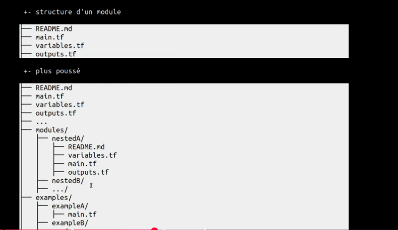

# Modules

- regroupement de fichiers de tf avec une cohérene en matière de ressource
- le repertoire principal est le root module
- la possibilité d'exploiter des modules definis dans la registry
- module = repertoire(s) + fichier(s) .tf

## Utiliser le module

module "monmodule"{
  source = ".repertoitr_module"
}

- variables
- version de modules

**Principe d'héritage**
- par défaut celui du fichier dans lequel il est appelé (root module ou autre)
- il est possible de surcharger un provider soit 
  - lors de la déclaration du module 
  - ou dans les fichiers de configuration  du module

**Instancier plusieurs fois un même module**
module "instance1"{
  source = ".repertoitr_module"
}

module "instance2"{
  source = ".repertoitr_module"
}

# Structure d'un modules

**Installation d'un module**

- terraform get 
- terraform init (car le module peux appeler les providers différents donc il faut les charger)

**peut permettre de gérer la gestion des dépendances**

- terraform apply -target=module.docker
- terraform apply -target=module.postgres

.
├── main.tf                  ← appelle le module 3 fois
├── variables.tf             ← variables globales
├── outputs.tf               ← outputs globaux
└── modules/
    └── compute/
        ├── main.tf          ← ressources du module
        ├── variables.tf     ← inputs du module
        └── outputs.tf       ← outputs du module

main.tf (parent)
    │
    ├── module "compute_dev"     → ./modules/compute
    │         ↓ inputs                   ↓ outputs
    │     env, instance_type  →   instance_id, public_ip
    │
    ├── module "compute_staging" → même module, variables différentes
    └── module "compute_prod"    → même module, variables différentes